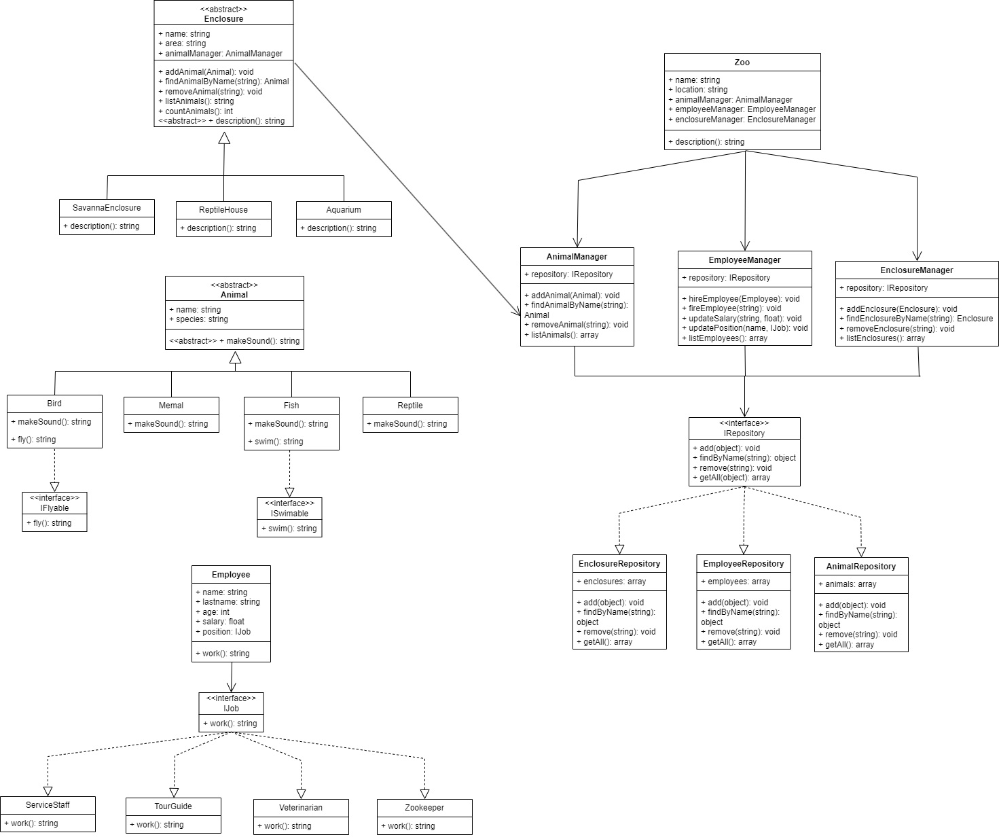

# PHP Zoo Project

This is a PHP project for managing a zoo, including listing animals and enclosures. Below are the instructions for setting up and running the project.

## Prerequisites

Before you begin, ensure you have the following installed:

- **PHP** (version 7.x or higher)  
  You can download and install PHP from [the official website](https://www.php.net/downloads).
- **Web Server** (like Apache or Nginx)  
  If you don't have one set up yet, you can use [XAMPP](https://www.apachefriends.org/index.html) (which includes Apache, MySQL, and PHP) or [MAMP](https://www.mamp.info/en/) for easy setup.

## Setting Up the Project

1. **Clone the Repository**  
   First, clone the project repository to your local machine using Git:

   ```bash
   git clone https://github.com/merelythesame/kpz-labs/tree/lab-1
   cd kpz-labs
   ```

## Adherence to Programming Principles

## 1. SOLID Principles

### Single Responsibility Principle (SRP)

- The [AnimalManager](https://github.com/merelythesame/kpz-labs/blob/lab-1/ZooManagmentClasses/AnimalManager.php]) class is solely responsible for managing animals.
- The [EmployeeManager](https://github.com/merelythesame/kpz-labs/blob/lab-1/ZooManagmentClasses/EmployeeManager.php) class is exclusively responsible for managing employees.
- The [EnclosureManager](https://github.com/merelythesame/kpz-labs/blob/lab-1/ZooManagmentClasses/EnclosureManager.php) class is responsible for managing enclosures.
- The [Zoo](https://github.com/merelythesame/kpz-labs/blob/lab-1/ZooManagmentClasses/Zoo.php) class only aggregates the managers and does not perform unnecessary functions.

### Open/Closed Principle (OCP)

- The abstract [Animal](https://github.com/merelythesame/kpz-labs/blob/lab-1/AnimalRelatedClasses/Animal.php) class allows adding new animal types (e.g., [Bird](https://github.com/merelythesame/kpz-labs/blob/lab-1/AnimalRelatedClasses/Bird.php), [Fish](https://github.com/merelythesame/kpz-labs/blob/lab-1/AnimalRelatedClasses/Fish.php), [Reptile](https://github.com/merelythesame/kpz-labs/blob/lab-1/AnimalRelatedClasses/Reptile.php)) without changing existing code.
- Interfaces like [IFlyable](https://github.com/merelythesame/kpz-labs/blob/lab-1/AnimalRelatedClasses/IFlyable.php) and [ISwimable](https://github.com/merelythesame/kpz-labs/blob/lab-1/AnimalRelatedClasses/ISwimable.php) make it easy to add new behaviors without modifying the base [Animal](https://github.com/merelythesame/kpz-labs/blob/lab-1/AnimalRelatedClasses/Animal.php) class.

### Liskov Substitution Principle (LSP)

- [Bird](https://github.com/merelythesame/kpz-labs/blob/lab-1/AnimalRelatedClasses/Bird.php), [Fish](https://github.com/merelythesame/kpz-labs/blob/lab-1/AnimalRelatedClasses/Fish.php), [Memal](https://github.com/merelythesame/kpz-labs/blob/lab-1/AnimalRelatedClasses/Memal.php), and [Reptile](https://github.com/merelythesame/kpz-labs/blob/lab-1/AnimalRelatedClasses/Reptile.php) all extend [Animal](https://github.com/merelythesame/kpz-labs/blob/lab-1/AnimalRelatedClasses/Animal.php) and behave the same way by implementing [makeSound()](https://github.com/merelythesame/kpz-labs/blob/lab-1/AnimalRelatedClasses/Animal.php#L16).
- Each subclass of [Enclosure](https://github.com/merelythesame/kpz-labs/blob/lab-1/EnclosureRelatedClasses/Enclosure.php) (e.g., [Aquarium](https://github.com/merelythesame/kpz-labs/blob/lab-1/EnclosureRelatedClasses/Aquarium.php), [SavannaEnclosure](https://github.com/merelythesame/kpz-labs/blob/lab-1/EnclosureRelatedClasses/SavannaEnclosure.php), [ReptileHouse](https://github.com/merelythesame/kpz-labs/blob/lab-1/EnclosureRelatedClasses/ReptileHouse.php)) works correctly within the [EnclosureManager](https://github.com/merelythesame/kpz-labs/blob/lab-1/ZooManagmentClasses/EnclosureManager.php) without changing the logic of the base class.

### Interface Segregation Principle (ISP)

- [IFlyable](https://github.com/merelythesame/kpz-labs/blob/lab-1/AnimalRelatedClasses/IFlyable.php) and [ISwimable](https://github.com/merelythesame/kpz-labs/blob/lab-1/AnimalRelatedClasses/ISwimable.php) interfaces allow animals to implement only the necessary behaviors.
- The [IJob](https://github.com/merelythesame/kpz-labs/blob/lab-1/EmployeeRelatedClasses/IJob.php) interface enables the implementation of various roles (e.g., [Zookeeper](https://github.com/merelythesame/kpz-labs/blob/lab-1/EmployeeRelatedClasses/Zookeeper.php), [Veterinarian](https://github.com/merelythesame/kpz-labs/blob/lab-1/EmployeeRelatedClasses/Veterinarian.php), [TourGuide](https://github.com/merelythesame/kpz-labs/blob/lab-1/EmployeeRelatedClasses/TourGuide.php)) without dependencies on other methods.

### Dependency Inversion Principle (DIP)

- [EmployeeManager](https://github.com/merelythesame/kpz-labs/blob/lab-1/ZooManagmentClasses/EmployeeManager.php), [AnimalManager](https://github.com/merelythesame/kpz-labs/blob/lab-1/ZooManagmentClasses/AnimalManager.php), and [EnclosureManager](https://github.com/merelythesame/kpz-labs/blob/lab-1/ZooManagmentClasses/EnclosureManager.php) work with the [IRepository](https://github.com/merelythesame/kpz-labs/blob/lab-1/ZooManagmentClasses/IRepository.php) interface, not specific implementations like [EmployeeRepository](https://github.com/merelythesame/kpz-labs/blob/lab-1/ZooManagmentClasses/EmployeeRepository.php), [AnimalRepository](https://github.com/merelythesame/kpz-labs/blob/lab-1/ZooManagmentClasses/AnimalRepository.php), or [EnclosureRepository](https://github.com/merelythesame/kpz-labs/blob/lab-1/ZooManagmentClasses/EnclosureRepository.php). This allows for easy changes to the data storage implementation without changing the logic in the managers.

## 2. Composition Over Inheritance

- The [Employee](https://github.com/merelythesame/kpz-labs/blob/lab-1/EmployeeRelatedClasses/Employee.php) class uses composition by holding [IJob](https://github.com/merelythesame/kpz-labs/blob/lab-1/EmployeeRelatedClasses/IJob.php) as an object, instead of inheriting from multiple positions (e.g., [Zookeeper](https://github.com/merelythesame/kpz-labs/blob/lab-1/EmployeeRelatedClasses/Zookeeper.php), [TourGuide](https://github.com/merelythesame/kpz-labs/blob/lab-1/EmployeeRelatedClasses/TourGuide.php)).
- The Animal class does not implement fly() or swim() methods directly. Instead, it uses the [IFlyable](https://github.com/merelythesame/kpz-labs/blob/lab-1/AnimalRelatedClasses/IFlyable.php) and [ISwimable](https://github.com/merelythesame/kpz-labs/blob/lab-1/AnimalRelatedClasses/ISwimable.php) interfaces, enabling more flexible class design.

## 3. Program to Interfaces, Not Implementations

- [EmployeeManager](https://github.com/merelythesame/kpz-labs/blob/lab-1/ZooManagmentClasses/EmployeeManager.php), [AnimalManager](https://github.com/merelythesame/kpz-labs/blob/lab-1/ZooManagmentClasses/AnimalManager.php), and [EnclosureManager](https://github.com/merelythesame/kpz-labs/blob/lab-1/ZooManagmentClasses/EnclosureManager.php) interact with the general [IRepository](https://github.com/merelythesame/kpz-labs/blob/lab-1/ZooManagmentClasses/IRepository.php) interface, rather than specific repository classes.
- [Employee](https://github.com/merelythesame/kpz-labs/blob/lab-1/EmployeeRelatedClasses/Employee.php) works through the [IJob](https://github.com/merelythesame/kpz-labs/blob/lab-1/EmployeeRelatedClasses/IJob.php) interface, which allows easy role changes without altering the [Employee](https://github.com/merelythesame/kpz-labs/blob/lab-1/EmployeeRelatedClasses/Employee.php) class.
- The [Zoo](https://github.com/merelythesame/kpz-labs/blob/lab-1/ZooManagmentClasses/Zoo.php) class aggregates managers that interact through abstractions, enabling internal implementation changes without altering the overall architecture.

### UML diagram:


